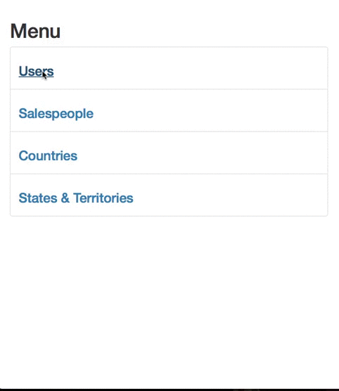

# Project 2 - Input/Output Sanitization

Time spent: 10 hours spent in total

## User Stories

The following **required** functionality is completed:

1\. [X]  Required: Import the Starting Database

2\. [X]  Required: Set Up the Starting Code

3\. [X]  Required: Review code for Staff CMS for Users

4\. [X]  Required: Complete Staff CMS for Salespeople
  * [X]  Required: index.php
  * [X]  Required: show.php
  * [X]  Required: new.php
  * [X]  Required: edit.php

5\. [X]  Required: Complete Staff CMS for States
  * [X]  Required: index.php
  * [X]  Required: show.php
  * [X]  Required: new.php
  * [X]  Required: edit.php

6\. [X]  Required: Complete Staff CMS for Territories
  * [X]  Required: index.php
  * [X]  Required: show.php
  * [X]  Required: new.php
  * [X]  Required: edit.php

7\. [X]  Required: Add Data Validations
  * [X]  Required: Validate that no values are left blank.
  * [X]  Required: Validate that all string values are less than 255 characters.
  * [X]  Required: Validate that usernames contain only the whitelisted characters.
  * [X]  Required: Validate that phone numbers contain only the whitelisted characters.
  * [X]  Required: Validate that email addresses contain only whitelisted characters.
  * [X]  Required: Add *at least 5* (now 6) other validations of your choosing.
    * [X]  Validate that all name values are at least 2 characters'
    * [X]  Validate that all name values contain only whitelisted characters: A-Z, a-z, spaces, and -,.'
    * [X]  Validate that state codes are at least 2 characters.
    * [X]  Validate that state codes contain only whitelisted characters: A-Z, a-z, 0-9
    * [X]  Validate that state country id contain only whitelisted characters: 0-9
    * [X]  Validate that all position values contain only whitelisted characters: 0-9

8\. [X]  Required: Sanitization
  * [X]  Required: All input and dynamic output should be sanitized.
  * [X]  Required: Sanitize dynamic data for URLs
  * [X]  Required: Sanitize dynamic data for HTML
  * [X]  Required: Sanitize dynamic data for SQL

9\. [X]  Required: Penetration Testing
  * [X]  Required: Verify form inputs are not vulnerable to SQLI attacks.
  * [X]  Required: Verify query strings are not vulnerable to SQLI attacks.
  * [X]  Required: Verify form inputs are not vulnerable to XSS attacks.
  * [X]  Required: Verify query strings are not vulnerable to XSS attacks.
  * [X]  Required: Listed other bugs or security vulnerabilities

The following advanced user stories are optional:

- [X]  Bonus: On "public/staff/territories/show.php", display the name of the state.

- [X]  Bonus: Validate the uniqueness of `users.username`.

- [X]  Bonus: Add a page for "public/staff/users/delete.php".

- [X]  Bonus: Add a Staff CMS for countries.

- [X]  Advanced: Nest the CMS for states inside of the Staff CMS for countries

The following additional features are implemented:

- [X]  Validate the uniqueness of `users.email`.

- [X]  Add a page for "public/staff/salespeople/delete.php".

- [X]  Validate that country code contain only whitelisted characters: A-Z

- [X]  Validate the uniqueness of `salespeople.email`.

- [X]  Validate the uniqueness of `countries.name`.

- [X]  Validate the uniqueness of `countries.code`.

- [X]  Validate the uniqueness of `states.name` under the same country id.

- [X]  Validate the uniqueness of `states.code` under the same country id.

- [X]  Validate the uniqueness of `territories.name` under the same state id.

- [X]  Validate the uniqueness of `territories.position` under the same state id.

## Video Walkthrough

Here's a walkthrough of implemented user stories:

## Notes

My computer has some problem that even if mysql is running, it cannot find the local host at all. I need to use the virtual environment (c9.io) to continue the development. It is using PHP 5.5.9.

## License

    Copyright 2017 Chi Hon Law

    Licensed under the Apache License, Version 2.0 (the "License");
    you may not use this file except in compliance with the License.
    You may obtain a copy of the License at

        http://www.apache.org/licenses/LICENSE-2.0

    Unless required by applicable law or agreed to in writing, software
    distributed under the License is distributed on an "AS IS" BASIS,
    WITHOUT WARRANTIES OR CONDITIONS OF ANY KIND, either express or implied.
    See the License for the specific language governing permissions and
    limitations under the License.